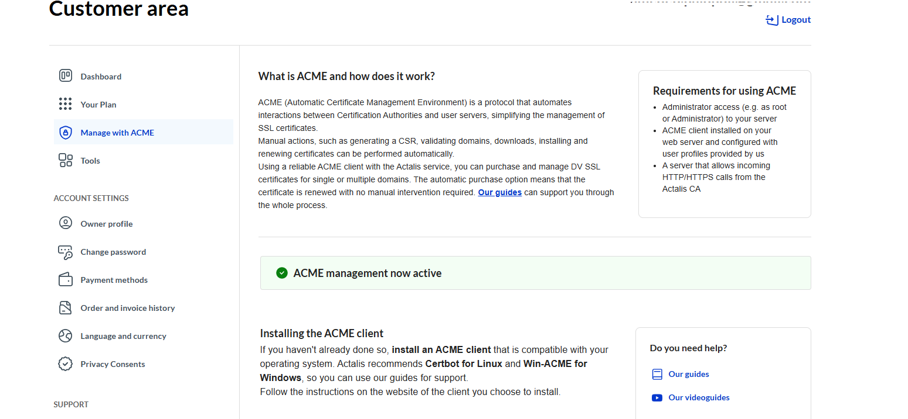

# actalis-cert-manager

A Helm chart to install cert-manager, configure Actalis ACME integration, and bootstrap secure certificate management for Kubernetes clusters.

## Features
- Installs cert-manager (CRDs must be installed manually)
- Creates Actalis External Account Binding (EAB) secret
- Configures ClusterIssuer for Actalis ACME
- Supports HTTP01 challenge via configurable ingress class

## Requirements
- Kubernetes >= 1.21
- Helm >= 3.0


## Actalis ACME Setup
1. [Create an Actalis account](https://www.actalis.com/).

2. Activate ACME support in your Actalis dashboard (see [Actalis ACME activation guideline](https://guide.actalis.com/ssl/activation/acme)):

  
3. Retrieve your ACME credentials (Key ID and HMAC Key):

  

## Installation

### Prerequisites

**Important:** You must install cert-manager and its CRDs before installing this chart. The chart will not work unless cert-manager is present and ready in your cluster.


Recommended: Install cert-manager and its CRDs in one step (wait for all pods to be ready):
```sh
helm repo add jetstack https://charts.jetstack.io
helm repo update
helm install cert-manager jetstack/cert-manager --namespace cert-manager --create-namespace --set crds.enabled=true --wait
```

⚠️  WARNING: `installCRDs` is deprecated, use `crds.enabled` instead.
⚠️  WARNING: The default private key rotation policy for Certificate resources is `Always` in cert-manager >= v1.18.0. See [release notes](https://cert-manager.io/docs/releases/release-notes/release-notes-1.18).

Verify cert-manager is running:
```sh
kubectl get pods -n cert-manager
kubectl get svc -n cert-manager
```

### Install the chart

Add the arubacloud Helm repository:
```bash
helm repo add arubacloud https://arubacloud.github.io/helm-charts/
helm repo update
```

Create a values file like **test-values.yaml**
```yaml
actalis:
  hmacKey: "_6lYptvZdi2ZWybRDO8_rfAmxIQSRBvrAszIcTIwdtE"
  kid: "qbjLGStU9KfgZNBBwPtWLKiZkn"
  email: "your-email@example.com"
  server: "https://acme-api.actalis.com/acme/directory"
  ingressClass: "nginx"
  clusterIssuer:
    enabled: true
  issuers:
    enabled: false
```


Then install this chart:
```sh
helm install actalis-cert-manager arubacloud/actalis-cert-manager --namespace cert-manager --create-namespace -f test-values.yaml --wait
```

## Parameters
| Name                | Description                                      | Default                        |
|---------------------|--------------------------------------------------|--------------------------------|
| `actalis.hmacKey`   | Actalis EAB HMAC key (base64url, unpadded)       | `CHANGE_ME_HMAC_KEY`           |
| `actalis.kid`       | Actalis EAB Key ID                               | `CHANGE_ME_KID`                |
| `actalis.email`     | Email for ACME registration                      | `change-me@example.com`        |
| `actalis.server`    | Actalis ACME server URL                          | `https://acme-api.actalis.com/acme/directory` |
| `actalis.ingressClass` | Ingress class for HTTP01 challenge             | `nginx`                        |
| `actalis.clusterIssuer.enabled` | Enable ClusterIssuer creation (cluster-wide) | `true` |
| `actalis.issuers.enabled` | Enable Issuer creation (namespace-scoped, supports multiple) | `false` |
| `actalis.issuers.list` | List of Issuer objects to create (name, namespace) | `[]` |

## Usage Example

After installing the chart, cert-manager will be set up and, by default, a ClusterIssuer for Actalis ACME will be created. You can request certificates using this ClusterIssuer (cluster-wide).

If you enable `actalis.issuers.enabled` and provide Issuer definitions in `actalis.issuers.list`, the chart will also create one or more namespace-scoped Issuer objects. This is useful if you want to restrict certificate management to specific namespaces or have different Issuer configurations.

Example Issuer definition in values.yaml:
```yaml
actalis:
  ...
  issuers:
    enabled: true
    list:
      - name: actalis-acme
        namespace: default
      - name: actalis-acme
        namespace: other-ns
```

You can then reference the Issuer in your Certificate resources within the specified namespace(s):
```yaml
apiVersion: cert-manager.io/v1
kind: Certificate
metadata:
  name: my-cert
  namespace: default
spec:
  issuerRef:
    name: actalis-acme
    kind: Issuer
  ...
```


### Automatic Certificate Creation via Ingress Annotation
You can have cert-manager automatically create and manage certificates for your Ingress resources by adding the following annotation:

**Domain and DNS Setup:**
To successfully issue certificates for `hello.devsecops2025-arubacloud.com`, you must own and manage the domain `devsecops2025-arubacloud.com`. Ensure you create a DNS A or CNAME record for `hello.devsecops2025-arubacloud.com` that points to the external IP address (or hostname) of your nginx ingress controller deployed in the Kubernetes cluster. This allows ACME HTTP01 challenge requests to reach your ingress controller and be validated by Actalis.

For example, if your ingress controller has an external IP of `203.0.113.10`, create a DNS record:

```
hello.devsecops2025-arubacloud.com. IN A 203.0.113.10
```

Or, if using a cloud load balancer, point the DNS record to the load balancer's hostname.

Once DNS is configured, cert-manager will automatically create the required Certificate resource and manage the TLS secret for your Ingress.


```yaml
apiVersion: apps/v1
kind: Deployment
metadata:
  name: hello-world
  namespace: default
spec:
  replicas: 1
  selector:
    matchLabels:
      app: hello-world
  template:
    metadata:
      labels:
        app: hello-world
    spec:
      containers:
        - name: hello-world
          image: hashicorp/http-echo:0.2.3
          args:
            - "-text=Hello, World!"
          ports:
            - containerPort: 5678
---
apiVersion: v1
kind: Service
metadata:
  name: hello-world
  namespace: default
spec:
  selector:
    app: hello-world
  ports:
    - protocol: TCP
      port: 80
      targetPort: 5678
---
apiVersion: networking.k8s.io/v1
kind: Ingress
metadata:
  name: hello-world-ingress
  namespace: default
  annotations:
    cert-manager.io/cluster-issuer: actalis-acme
spec:
  ingressClassName: nginx
  tls:
    - hosts:
        - hello.devsecops2025-arubacloud.com
      secretName: hello-devsecops2025-arubacloud-com-tls
  rules:
    - host: hello.devsecops2025-arubacloud.com
      http:
        paths:
          - path: /
            pathType: Prefix
            backend:
              service:
                name: hello-world
                port:
                  number: 80
```

With this annotation, cert-manager will automatically create the required Certificate resource and manage the TLS secret for your Ingress.

## Troubleshooting
- Ensure your EAB HMAC key is base64url-encoded and unpadded (no trailing `=`).
- Wait for all cert-manager pods to be ready before applying ACME resources.
- If you see webhook TLS errors, wait a few minutes and retry.
- For ACME registration errors, double-check your Key ID and HMAC key format.

- If you see an error like `CustomResourceDefinition ... exists and cannot be imported into the current release: invalid ownership metadata`, it means cert-manager CRDs are already present but not managed by Helm. This is expected; cert-manager CRDs should always be installed and managed outside of Helm charts. To resolve, ensure you have installed cert-manager CRDs manually before installing this chart.


## Uninstall

kubectl delete namespace cert-manager

To uninstall actalis-cert-manager:
```sh
helm uninstall actalis-cert-manager --namespace cert-manager
```

To uninstall cert-manager:
```sh
helm uninstall cert-manager --namespace cert-manager
```

To remove cert-manager CRDs and namespace (optional, for a full cleanup):
```sh
kubectl delete crd certificaterequests.cert-manager.io certificates.cert-manager.io challenges.acme.cert-manager.io clusterissuers.cert-manager.io issuers.cert-manager.io orders.acme.cert-manager.io
kubectl delete namespace cert-manager
```

## Support
For issues with this chart, open an issue in your repository or consult the [cert-manager documentation](https://cert-manager.io/docs/).

For Actalis ACME support, refer to [Actalis documentation](https://guide.actalis.com/ssl/) or the [Actalis FAQ](https://guide.actalis.com/faq).
